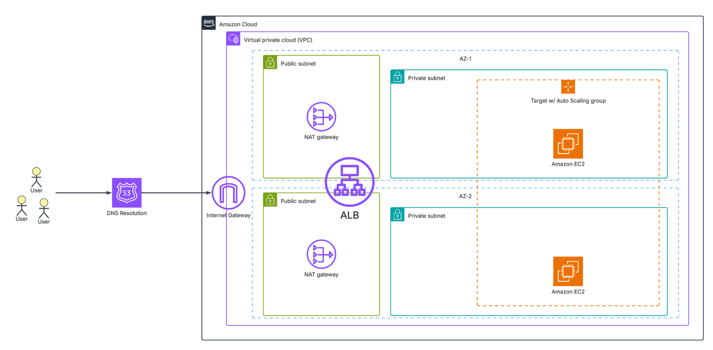
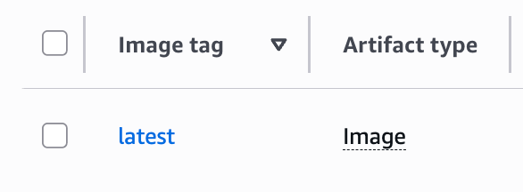

# **Secure, High-Availability Web Application Deployment on AWS EC2 (Automated)**

A step-by-step guide to securely deploying a resilient web app using only AWS EC2 and foundational services—bypassing PaaS tools like ECS or Elastic Beanstalk.

## **Introduction**

The core objective of this project was to **fully automate the deployment** of a simple web application to AWS using only Amazon EC2 instances. This report details the complete process, covering the setup, networking, and IAM configuration while strictly adhering to secure and repeatable deployment practices.

This deployment specifically avoids Platform-as-a-Service (PaaS) offerings such as AWS Elastic Beanstalk or ECS. Instead, the solution relies exclusively on foundational AWS components centered around EC2.

While modern cloud deployments commonly utilize container orchestration tools like Kubernetes, executing a manual EC2-centric deployment provides invaluable experience. This approach ensures fine-grained control over virtual machines and builds a deep, practical understanding of AWS core services and infrastructure management.

## **Project Objectives**

The primary objectives for this project were to achieve a robust, automated, and highly available deployment:

1. **Automate Deployment:** Develop a repeatable and efficient Infrastructure-as-Code (IaC) process using Terraform for provisioning and a CI/CD pipeline (GitHub Actions) for application deployment.
2. **Implement Secure Infrastructure:** Configure network isolation (VPC), restrict access via Security Groups, and manage access using IAM roles in alignment with AWS security best practices (least privilege).
3. **Demonstrate Core AWS Concepts:** Effectively utilize foundational AWS services such as EC2, VPC, Security Groups, IAM, Route 53, and ACM.
4. **Ensure High Availability (HA):** Design the deployment to maintain uptime and resilience through multi-Availability Zone (AZ) configurations and load balancing.
5. **Deliver Clear Documentation:** Provide a concise, well-structured article that includes architecture diagrams and explicit explanations of all configuration and security choices.

## **Table of Contents**

- [**Secure, High-Availability Web Application Deployment on AWS EC2 (Automated)**](#secure-high-availability-web-application-deployment-on-aws-ec2-automated)
  - [**Introduction**](#introduction)
  - [**Project Objectives**](#project-objectives)
  - [**Architecture Overview**](#architecture-overview)
  - [**Setup and Prerequisites**](#setup-and-prerequisites)
  - [**Key Infrastructure Components**](#key-infrastructure-components)
    - [**EC2 (Compute)**](#ec2-compute)
    - [**VPC (Networking & Security)**](#vpc-networking--security)
    - [**IAM (Identity and Access Management)**](#iam-identity-and-access-management)
    - [**Route 53 (DNS)**](#route-53-dns)
    - [**ALB (Load Balancing)**](#alb-load-balancing)
    - [**ACM (Certificates)**](#acm-certificates)
  - [**DNS Additional Details**](#dns-additional-details)
  - [**Network and Security Deep Dive**](#network-and-security-deep-dive)
    - [**VPC and Subnets**](#vpc-and-subnets)
    - [**Application Load Balancer (ALB) Configuration**](#application-load-balancer-alb-configuration)
    - [**Auto Scaling Group (ASG)**](#auto-scaling-group-asg)
    - [**Security Groups**](#security-groups)
    - [**Traffic and Encryption**](#traffic-and-encryption)
    - [**Temporary and Secure SSH Access**](#temporary-and-secure-ssh-access)
  - [**CI/CD: GitHub Actions**](#cicd-github-actions)
  - [**Automated EC2 Provisioning: The User Data Script**](#automated-ec2-provisioning-the-user-data-script)
  - [**The App**](#the-app)
    - [**Stack**](#stack)
    - [**APIs**](#apis)
  - [**Conclusion**](#conclusion)

## **Architecture Overview**

The final deployment architecture is a secure and scalable AWS environment centered around EC2 instances. Supporting services like VPC, IAM, and ACM ensure proper isolation, identity management, and encrypted traffic. Route 53 and an Application Load Balancer (ALB) enable high availability and public accessibility through DNS resolution and request distribution.



## **Setup and Prerequisites**

To replicate this deployment, the following components and knowledge are necessary:

- Basic understanding of Linux administration and web application deployment.
- An AWS account with appropriate IAM permissions (for the initial IAM/OIDC setup).
- Familiarity with NGINX as a reverse proxy/web server.
- A configured SSH key pair for necessary instance access and debugging (though SSH is restricted).
- Install [Terraform](https://developer.hashicorp.com/terraform/install) and [AWS CLI](https://aws.amazon.com/cli/).
- Configure your AWS credentials (`aws configure`).
- Set up a Route 53 Hosted Zone and update your DNS registrar with the provided nameservers.
- Run the GitHub Actions workflow to build and push the code to ECR (ensure your repository is configured to allow OIDC access to AWS, see later steps).
- Run `terraform init && terraform apply` in the `/infra` directory **after** adding the following values to a `terraform.tfvars` file:

```bash
hosted_zone_id = "" # see the DNS Additional Details section
my_ip          = "xxx.xxx.xxx.xxx/32"
aws_account_id = ""
```

## **Key Infrastructure Components**

### **EC2 (Compute)**

- **Hosts the Web Application:** EC2 instances are the core compute layer.
- **High Availability:** Multiple instances are launched in private subnets via an **Auto Scaling Group (ASG)** spanning two Availability Zones (AZs).
- **Access Control:** An IAM role is attached to the instances to allow secure pulling of container images from ECR.

### **VPC (Networking & Security)**

- **Isolation:** Uses public and private subnets across multiple AZs (us-east-1a and us-east-1b).
- **Public Access:** An **Internet Gateway (IGW)** allows public subnet access (for the ALB).
- **Outbound Access:** A **NAT Gateway** allows instances in the private subnets to reach the internet (e.g., to pull ECR images) without being publicly accessible themselves.
- **Access Control:** **Security Groups** restrict access only to necessary ports (HTTP/HTTPS) and protocols (SSH from known IPs).

### **IAM (Identity and Access Management)**

- **Least Privilege:** An IAM role with minimal required permissions is attached directly to the EC2 instances, specifically granting read access to ECR for image pulling.
- **OIDC Integration:** Utilizes OpenID Connect (OIDC) to federate identity between GitHub Actions and AWS, eliminating the need to store static AWS access keys as GitHub secrets (a major security enhancement).

### **Route 53 (DNS)**

- **Domain Resolution:** A Hosted Zone is configured to point the custom domain to the ALB.
- **Public Link:** An A record resolves the domain traffic to the Load Balancer's DNS name.

### **ALB (Load Balancing)**

- **Traffic Distribution:** Distributes incoming public traffic across the multiple EC2 instances in the ASG for HA and fault tolerance.
- **Target Group:** Holds the EC2 instances, defining the ports and protocols for routing.
- **Health Checks:** Configured to automatically detect and stop sending traffic to unhealthy instances, by sending periodic HTTP requests to the `/` path, ensuring high availability.

### **ACM (Certificates)**

- **Encryption:** An **AWS Certificate Manager (ACM)** certificate is attached to the ALB listener for HTTPS.
- **Secure Transport:** This ensures encrypted traffic between the client's browser and the web application's entry point (the ALB).

## **DNS Additional Details**

You will need to update your nameservers on your domain registrar and add a Hosted Zone. Use the **Hosted Zone id** you receive from Route 53 in your `terraform.tfvars` file.

For registrars, I use Namecheap, so I update the custom DNS with the nameservers that Route 53 provides:


The values for the nameserver update will be under the NS record:  


Lastly, Terraform will automatically create the required DNS records for ACM validation and the ALB after deployment, enabling the application to be accessed through a properly configured and secured domain.


## **Network and Security Deep Dive**

### **VPC and Subnets**

The architecture uses a single VPC structured with dedicated public and private subnets across two AZs.

- **Public Subnets:** Host the Application Load Balancer (ALB) and a jump server for temporary, restricted SSH access.
- **Private Subnets:** Host the EC2 instances running the application within the Auto Scaling Group. These instances cannot be accessed directly from the internet.

### **Application Load Balancer (ALB) Configuration**

The ALB spans the public subnets in both AZs, maximizing availability. It serves as the primary ingress point, forwarding client HTTP/HTTPS traffic to the private Target Group. The crucial health checks confirm the application is responding correctly before routing traffic to an instance.

### **Auto Scaling Group (ASG)**

The ASG is configured to span both private subnets, automatically maintaining a desired number of running EC2 instances. This multi-AZ setup ensures that if one AZ fails, the instances in the other AZ can handle the load, providing the required High Availability.

### **Security Groups**

The security groups enforce strict network segmentation:

- **ALB SG:** Allows inbound traffic only on ports **80 (HTTP)** and **443 (HTTPS)** from 0.0.0.0/0 (the internet).
- **EC2 SG:** Allows inbound traffic **only from the ALB Security Group** (ports 80/443). This prevents any direct internet access to the application instances.
- **Jump Server SG:** Allows inbound **SSH (22)** access only from a set of **trusted, known developer IP addresses**.
- **Outbound Traffic:** All outbound traffic is restricted to only necessary destinations.

### **Traffic and Encryption**

1. **HTTPS Redirect:** The ALB is configured to redirect all incoming HTTP (port 80) requests to HTTPS (port 443).
2. **External TLS:** Traffic between clients and the ALB is encrypted using the **ACM TLS certificate**.
3. **Internal Traffic:** Traffic from the ALB to the EC2 instances in the private subnets is unencrypted (plain HTTP). This is acceptable as the private subnets are highly isolated and the traffic never leaves the VPC network boundary.

### **Temporary and Secure SSH Access**

SSH access is restricted to the bare minimum for debugging and troubleshooting. It is only accessible via a jump server located in the public subnet. By limiting the Jump Server SG to only trusted developer IPs, we minimize the attack surface. After deployment validation is complete, this temporary SSH access can be completely disabled via the security group.

## **CI/CD: GitHub Actions**

A primary security focus for this project was to minimize the total amount of secrets required throughout the deployment workflow. By leveraging **OpenID Connect (OIDC)**, the GitHub Actions workflow requires only two non-secret values for authentication:

1. `AWS_ROLE_TO_ASSUME`: This is the Amazon Resource Name (ARN) of the specific IAM role that the workflow assumes to interact with AWS. This role must be configured with a trust policy that allows the GitHub Actions identity provider to assume it. The value is prefixed with `arn:`.
   - _Reference:_ For setup guidance, refer to the [GitHub Docs for OIDC in AWS](https://docs.github.com/en/actions/how-tos/secure-your-work/security-harden-deployments/oidc-in-aws).
2. `AWS_ACCOUNT_ID`: This is the 12-digit AWS account number. While AWS does not technically classify this as a secret, it should still be handled carefully.

The workflow, shown below, automates the build of the application and pushes the container images directly to **ECR (Elastic Container Registry)**, which the EC2 instances then pull via their attached IAM role.


Once the workflow is done, the required repositories, client and server, are present and available in ECR:


Additionally, you should be able to see your images present (by default with the `latest` tag):



## **Automated EC2 Provisioning: The User Data Script**

All instance setup is automated via a User Data script embedded in the ASG's launch template. This script executes on first boot, performing all configuration steps that would otherwise be done manually via SSH.

The script, located at `infra/scripts/user_data`, performs the following critical sequence:

1. Installs and enables the Docker service.
2. Installs Docker Compose for multi-container management.
3. Securely authenticates to ECR using the EC2 instance's attached IAM role.
4. Creates the compose.yml file with references to the latest ECR images.
5. Starts the application containers, making the instance ready for the ALB Target Group.

> **Note on Configuration Files:** The `compose.yml` file is created directly via a script's heredoc because its content is minimal. Alternative options for managing larger or more complex configuration files include pushing them to **AWS S3** and pulling them into your instances via appropriate **IAM policy injection**.

## **The App**

### **Stack**

- **Client:** Next/React/TypeScript
- **Server:** Rust (actix-web)
- **Reverse Proxy:** NGINX

### **APIs**

- **Talk to Cat:** Sends a request to `/hello`. Returns the json `{"message": "meow"}`.
- **Get Cat:** Sends a request to `/cat`. Fetches and returns a random cat picture from [CATAAS](https://cataas.com/).

Landing page:


Endpoint `/hello`:


Endpoint `/cat`:


As you can see the site is secure via the ALB listener working with ACM.

## **Conclusion**

This project successfully demonstrates an automated, secure, and highly available deployment onto AWS EC2 instances, while deliberately avoiding high-level managed services. The infrastructure, provisioned using **Terraform**, establishes network isolation and least-privilege access, while the application deployment via **GitHub Actions** and **OIDC** ensures a secure and repeatable CI/CD pipeline. The use of multi-AZ ASGs and an ALB provides robust High Availability, proving that sophisticated, secure deployments are achievable even when restricted to foundational EC2 components.
