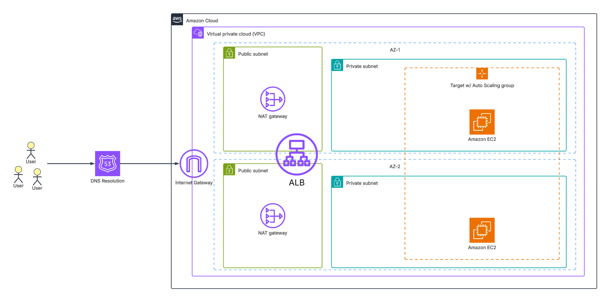

# Securely Deploying a Highly Availability (HA) Web Application on AWS EC2 (Automated)

> A step-by-step guide to manually deploying a secure, high-availability web app on AWS EC2 — without ECS, Elastic Beanstalk, or other deployment services.

## Introduction

The goal of this project is to automate the deployment of a simple web application to AWS using only EC2. This report covers the full process — including setup, networking, and IAM configuration — while maintaining a focus on secure and repeatable deployment practices.

We will not be using any Platform-as-a-Service (PaaS) offerings such as AWS Elastic Beanstalk or ECS; the deployment will rely solely on Amazon EC2.

Although most modern deployments leverage container orchestration tools like Kubernetes, manually deploying on EC2 remains valuable for gaining fine-grained control over virtual machines and for building a deep understanding of AWS core services and infrastructure management.

## Objectives

The primary objectives of this project are as follows:

1. Automate Deployment: Develop a repeatable and efficient process for deploying a web application using AWS EC2 instances.
2. Implement Secure Infrastructure: Configure network isolation, IAM roles, and access controls in alignment with AWS security best practices.
3. Demonstrate Core AWS Concepts: Utilize foundational AWS services such as EC2, VPC, Security Groups, and IAM to build a secure and controlled deployment environment.
4. Ensure HA: Design the deployment to maintain uptime and resilience through multi-AZ configurations and load balancing.
5. Deliver Clear Documentation: Provide a concise, well-structured report that includes architecture diagrams and explanations of configuration and security choices.

## Architecture Overview

The deployment architecture consists of a secure and scalable AWS environment centered around EC2 instances. Supporting services such as VPC, IAM, and ACM are used to ensure proper isolation, identity management, and encrypted traffic. Route 53 and an Application Load Balancer (ALB) enable high availability and public accessibility through DNS routing and request distribution.

## Prerequisites

* An AWS account with appropriate IAM permissions.
* A configured SSH key pair for secure instance access and debugging.
* Basic understanding of Linux system administration and web application deployment.
* Familiarity with NGINX as a reverse proxy and web server.
* Working knowledge of Bash scripting for automation tasks.
* Understanding of Infrastructure-as-Code (IaC) concepts using Terraform for reproducible deployments.

## Key Components

### EC2 (Compute)
- Hosts the web application.
- Launch multiple instances in public/private subnets for HA using Auto Scaling groups.
- Attach IAM role to allow pulling images from ECR.

### VPC (Networking & Security)
- Public and private subnets across multiple AZs.
- Internet Gateway for public subnet access.
- NAT Gateway for private subnet outbound traffic.
- Security Groups restrict access to HTTP/HTTPS and SSH from known IPs.

### IAM (Access Control)
- Role attached to EC2 for ECR access.
- Principle of least privilege applied.

### Route 53 (DNS)
- Hosted Zone points domain to ALB.
- DNS A record resolves traffic to the load balancer.

### ALB (Load Balancing)
- Distributes traffic across multiple EC2 instances for HA.
- Target Group contains the EC2 instances.
- Health checks detect unhealthy instances.

### ACM (Certificates)
- ACM certificate attached to ALB listener for HTTPS.
- Ensures encrypted traffic to the web app.

## Network and Security Setup

### VPC and Subnets
- Single VPC with public and private subnets across two Availability Zones (us-east-1a and us-east-1b).
- Public subnets host the Application Load Balancer (ALB) and the jump server for temporary SSH access.
- Private subnets host EC2 instances running the application within an Auto Scaling Group for HA.

### Application Load Balancer (ALB)
- ALB spans the multi-AZ public subnets.
- Forwards HTTP/HTTPS traffic to the private subnet Target Group containing the EC2 instances.
- Health checks configured to ensure traffic is only sent to healthy instances.

### Auto Scaling Group (ASG)
- EC2 instances registered in a Target Group for the ALB.
- ASG spans both private subnets in separate AZs.
- Automatically maintains desired instance count for HA.
- Optional scaling policies can adjust instance count based on load.

### Security Groups
- **ALB SG:** Allows inbound HTTP (80) and HTTPS (443) from the internet.
- **EC2 SG:** Allows inbound traffic only from ALB SG (ports 80/443).
- **Jump Server SG:** Temporary SSH access from trusted IPs only.
- Outbound traffic restricted to necessary destinations.

### IAM Roles
- EC2 instances have IAM role attached to pull images from ECR.
- Principle of least privilege applied to all roles.

### Temporary SSH Access
- SSH enabled only via jump server for debugging.
- Jump server resides in public subnet with limited access.
- After deployment validation, SSH can be disabled to minimize attack surface.

### Traffic and Encryption
- All incoming HTTP traffic is redirected to HTTPS at the ALB.
- Traffic between clients and the ALB is encrypted using ACM TLS certificates.
- Traffic from the ALB to EC2 instances in private subnets is unencrypted.
  - This is acceptable because the private subnets are isolated and not directly accessible from the internet.
  - Optionally, internal TLS can be used, but it is not required for this deployment.
